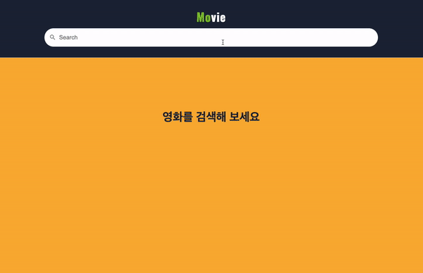
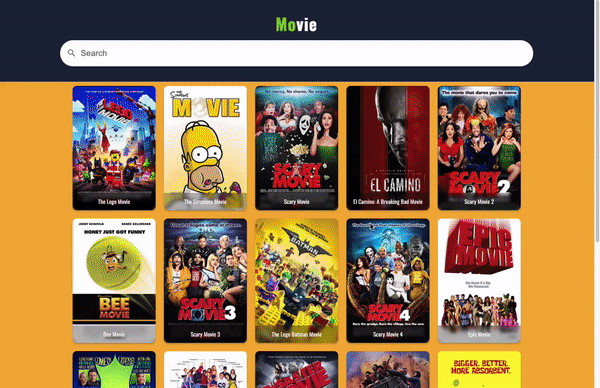
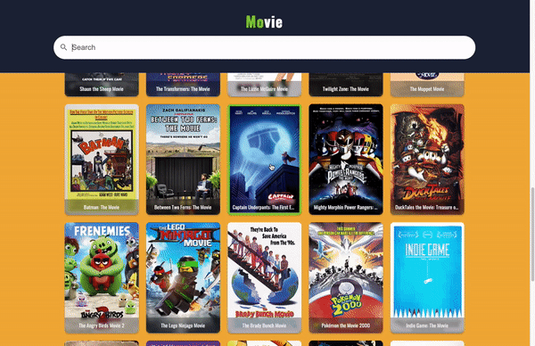
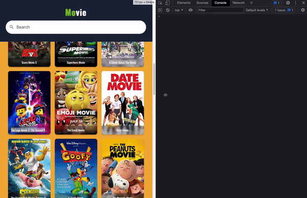

# Movie Search

## 소개 ⭐️

🍿 영화 정보를 검색하면 보여주는 웹 어플리케이션 🍿

> 배포 : [https://hungry-kilby-3301d0.netlify.app/](https://hungry-kilby-3301d0.netlify.app/)

### 사용 기술

    
    
    
    

 

## 주요 기능 ⭐️

### 영화 검색

영화를 검색하면 영화 목록을 보여줍니다.

	

### 무한 스크롤

마우스 스크롤 이벤트를 debounce 하여 스크롤을 감지, 영화 정보를 무한 스크롤을 통해 가져옵니다.

	

### 영화 상세 정보

영화 포스터 클릭시 상세정보를 가져옵니다.

	

### 반응형

모자일 디바이스등 다양한 디바이스 환경을 고려하여 반응형을 지원합니다.

	

 

## 회고 ⭐️

### 느낀점

`Redux`와 `Styled Components` 를 사용하는 것이 처음에는 익숙하지 않아서 실수도 많이 했는데 사용해 보면서 왜 Redux를 사용하고 `Styled Components` 를 사용하는지 알게 되었던것 같습니다.

state 에 불변성을 위해서 `immutable.js`를 사용했는데 기존에 불변성을 지키기 위해서 했던 작업이 쉽게 가능해서 굉장히 편했습니다. 기존에 불편하게 했었던 작업들도 편하게 해주는 여러 도구들이 있을지 궁금해져서 찾아보고 싶어졌습니다.

### 배운점

- `Redux`를 사용할때 프리젠테이셔널 컴포넌트와 컨테이너 컴포넌트를 분리하는 패턴
- `Redux Thunk`를 사용한 비동기 처리 방법
- `Styled Componets` 를 이용한 페이지 레이아웃 및 스타일 방법
- `Netlify` 에서 `Serverless function`을 사용하는 방법
- 무한스크롤 UI를 만드는 방법

### 앞으로

- 페이지를 효율적으로 구성하기 위한 컴포넌트 패턴이 있는지 찾아보기
- `TypeScript`를 사용해서 `React` 프로젝트 만들어보기
- `storybook` 을 만들어 보기
- 여러 페이지를 가지는 앱 만들어 보기
